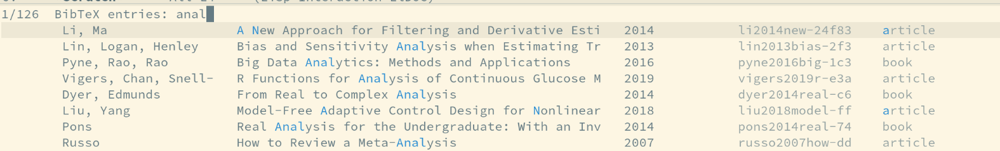
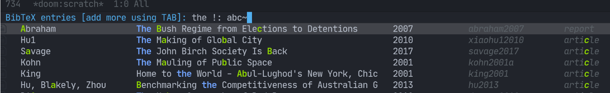
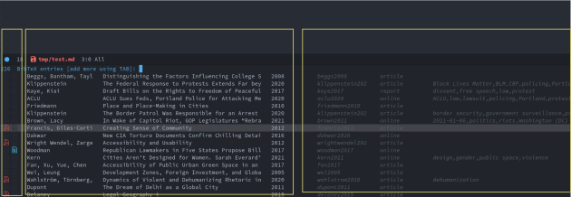

[](https://melpa.org/#/bibtex-actions)

# BibTeX Actions

- [What is it?](#what-is-it)
- [Installation](#installation)
- [Configuration](#configuration)
- [Usage](#usage)
- [Comparisons](#comparisons)
- [Acknowledgements](#acknowledgements)

## What is it?

This package turns bibtex-completion functions into completing-read-based Emacs commands. 
When used with selectrum, embark, and marginalia, it provides similar functionality to helm-bibtex and ivy-bibtex: quick filtering and selecting of bibliographic entries from the minibuffer, and the option to run different commands against them.

Here's a screenshot with [selectrum][selectrum] and [embark][embark].


And another with [vertico][vertico]:



## Installation

Bibtex-actions is available for installation from [MELPA][melpa].

The repository `test` directory includes a script you can use to run this and associated packages in the `emacs -Q` sandbox. 
To do that, simply run `./run.sh` from the `test` directory. 
By default, this will use selectrum as the completion system. 
If you would like to try vertico instead, you can select `vertico-mode`.

To setup bibtex-actions using `use-package`, you can simply do:

``` emacs-lisp
(use-package bibtex-actions
  :defer t
  :config
  ;; Make the 'bibtex-actions' bindings available from `embark-act'.
  (add-to-list 'embark-keymap-alist '(bibtex . bibtex-actions-map)))
```

## Configuration

### Basic

Since most of the command logic resides in bibtex-completion, that is where to look for different [configuration options][bt-config]. 

The only thing, however, that you _must_ configure is where to find your bib file(s). 

``` emacs-lisp
(setq bibtex-completion-bibliography "~/bib/references.bib")
```

To access these commands from `embark-act`, set this variable.

``` emacs-lisp
(setf (alist-get 'bibtex embark-keymap-alist) 'bibtex-actions-map)
```

### Completion styles

One of the beauties of the new suite of completing-read packages is the flexibility. 
You can read more about this at the [selectrum README][select], but here's an example using orderless with its [style dispatchers][ordeless-dispatchers].



In this case, that search string is searching for all items without either a PDF or note associated with them, and then includes a "the" initialism, and a flex search on "abc".

### Rich UI

There are three sections of the browsing UI. 

1. The prefix, exploiting the affixation feature only available starting with Emacs 28, and holding the symbols to indicate the presence of PDFs or notes associated with the entries.
2. The main display, which by default shows author, title, and date.
3. The suffix, which by default shows citekey, reference type, and (if present) tags or keywords.

You can search against all of the above content. 
For the prefix, you can filter for associated PDFs or notes using `has:pdf` or `has:note` respectively (and at least with my setup, even the `:p` or `:n` shorthand).



You can configure both of the last two just as you do with bibtex-completion.

``` emacs-lisp
(setq bibtex-actions-display-template '((t . " ${title=:*}")))
(setq bibtex-actions-display-template-suffix '((t . "          ${=key=:15}")))
```

Note: the asterisk signals to the formatter to use available space for the column. 
You should only use this on one field total, across the two templates, for the formatting to work correctly.

By default, this UI is plain text, but you can configure it to use icons instead. 


Here's how to configure it to use `all-the-icons`:

``` emacs-lisp
(setq bibtex-actions-symbols
  `((pdf . (,(all-the-icons-icon-for-file "foo.pdf" :face 'all-the-icons-dred) .
            ,(all-the-icons-icon-for-file "foo.pdf" :face 'bibtex-actions-icon-dim)))
    (note . (,(all-the-icons-icon-for-file "foo.txt") .
            ,(all-the-icons-icon-for-file "foo.txt" :face 'bibtex-actions-icon-dim)))        
    (link . 
        (,(all-the-icons-faicon "external-link-square" :v-adjust 0.02 :face 'all-the-icons-dpurple) .
        ,(all-the-icons-faicon "external-link-square" :v-adjust 0.02 :face 'bibtex-actions-icon-dim)))))
;; Here we define a face to dim non 'active' icons, but preserve alignment
(defface bibtex-actions-icon-dim
    '((((background dark)) :foreground "#282c34")
     (((background light)) :foreground "#fafafa"))
     "Face for obscuring/dimming icons"
     :group 'all-the-icons-faces)
```

### Proactive reloading of library

Bibtex-actions uses a cache to speed up library display. 
This is great for performance, but means the data can become stale if you modify it. 

The `bibtex-actions-refresh` command will reload the cache, and you can call this manually. 

You can also add `bibtex-completion`-style proactive loading by using `filenotify` something like this:

``` emacs-lisp
;; Of course, you could also use `bibtex-completion-bibliography` here, but would need 
;; to adapt this if you specify multiple files.
(file-notify-add-watch 
  "/path/to/file.bib" '(change) 'bibtex-actions-refresh)
```

You can also extend this to do the same thing for your PDF files, or notes:

``` emacs-lisp
(file-notify-add-watch 
  bibtex-completion-library-path '(change) 'bibtex-actions-refresh)

(file-notify-add-watch 
  bibtex-completion-note-path '(change) 'bibtex-actions-refresh)
```

For additional configuration options on this, see [the wiki](https://github.com/bdarcus/bibtex-actions/wiki/Configuration#automating-path-watches).

## Usage

You have a few different ways to interact with these commands.

### `M-x`

Simply do `M-x` and select the command that you want, enter the terms to find the item you are looking for, and hit return. 
This runs the default action: the command you invoked.

Here's the view, using marginalia for annotations.


A note on multiple candidate selection:

These commands do allow you to select multiple items, with two caveats:

1. For this to work correctly, you _must_ use the ampersand (`&`) as `crm-separator` to separate the candidates.
2. We use very long candidate strings, so if you use a completion system that requires you to `TAB`-complete, the experience is less-than-ideal.

### Access an alternate action via `embark-act`

If while browsing you instead would rather edit that record, and you have embark installed and configured, this is where `embark-act` comes in. 
Simply input the keybinding for `embark-act` (in my case `C-o`), and select the alternate action.

### Use `embark-collect-snapshot`

A final option, that can be very useful: run `embark-collect-snapshot` (`S`) from `embark-act`. 
This will select the candidate subset, and open it in a separate buffer. 
From there, you can run the same options discussed above using `embark-act` (which is also bound to `a` in the collect buffer).

So, for example, say you are working on a paper. 
You hold the complete superset of items you are interested in citing at some point in that buffer. 
From there, you can run different actions on the candidates at will, rather than search individually for each item you want to cite.

## Comparisons

This is inspired by `helm-bibtex` and `ivy-bibtex`, but is based on `completing-read`. In comparison:


- like `helm-bibtex`, but unlike `ivy-bibtex`, `bibtex-actions` has support for multi-selection of candidates
- `helm-bibtex` and `ivy-bibtex` provide a single command, and the actions are accessed from there; `bibtex-actions` provides all of its actions as standard commands, available from `M-x`, without a single entry point.
- `bibtex-actions` is based on `completing-read-multiple`, with a single dependency, and works with different completion systems (though in practice is best supported in `selectrum`) and supporting packages that are `completing-read` compliant; `helm-bibtex` and `ivy-bibtex` are based on `helm` and `ivy` respectively

## Acknowledgements

The ideas in this project were initially worked out in a [conversation][idea-issue] with [Maxime Tréca][mtreca] and [Daniel Mendler][minad]. 
Daniel, author of [consult][consult] and [marginalia][marginalia], helped us understand the possibilties of the new suite of completing-read packages, while Maxime came up with an [initial prototype][idea-pr].

This code takes those ideas and reimplements them to fill out the feature set, and also optimize the code clarity and performance.

Along the way, [Clemens Radermacher][clemens] and [Omar Antolín][omar] helped with some of the intricacies of completing-read and elisp.

And, of course, thanks to [Titus von der Malburg][titus] for creating and maintaining bibtex-completion and helm-bibtex and ivy-bibtex.

[bt-config]: https://github.com/tmalsburg/helm-bibtex#basic-configuration-recommended
[ordeless-dispatchers]: https://github.com/oantolin/orderless#style-dispatchers
[select]: https://github.com/raxod502/selectrum#usage
[selectrum]: https://github.com/raxod502/selectrum
[embark]: https://github.com/oantolin/embark/
[vertico]: https://github.com/minad/vertico
[melpa]: https://melpa.org
[mtreca]: https://github.com/mtreca
[minad]: https://github.com/minad
[clemens]: https://github.com/clemera
[omar]: https://github.com/oantolin
[titus]: https://github.com/tmalsburg
[consult]: https://github.com/minad/consult
[marginalia]: https://github.com/minad/marginalia
[idea-issue]: https://github.com/tmalsburg/helm-bibtex/issues/353
[idea-pr]: https://github.com/tmalsburg/helm-bibtex/pull/355
