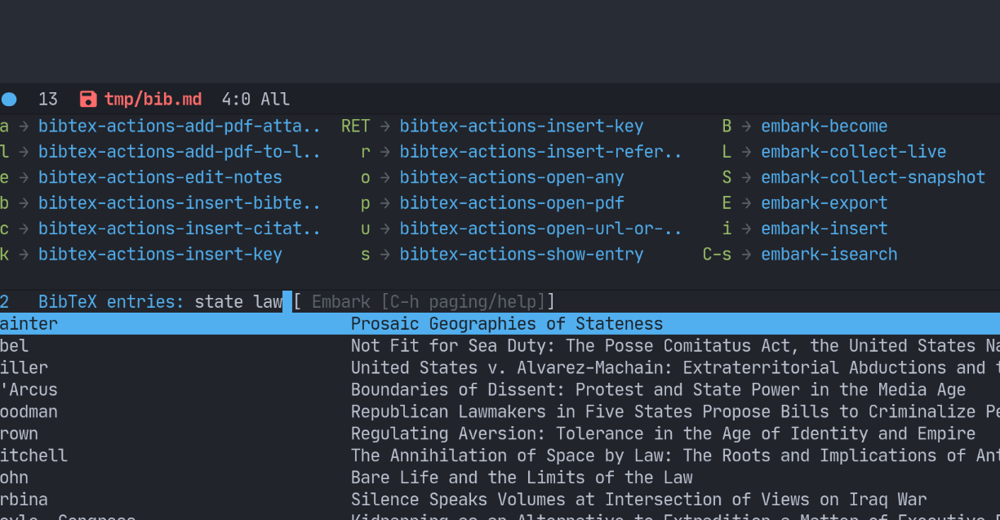
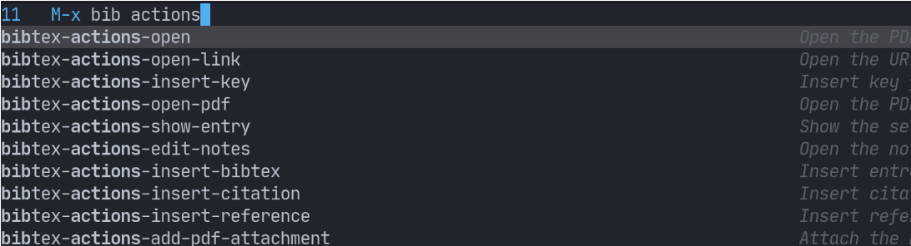

# BibTeX Actions

THIS IS AN EXPERIMENT ATM

- [What is it?](#what-is-it)
- [Installation](#installation)
- [Configuration](#configuration)
- [Usage](#usage)

## What is it?

This package turns bibtex-completion functions into completing-read-based Emacs commands. 
When used with selectrum, embark, and marginalia, it provides similar functionality to helm-bibtex and ivy-bibtex: quick filtering and selecting of bibliographic entries from the minibuffer, and the option to run different commands against them.

Here's a screenshot with selectrum and embark.



## Installation

If you happen to be using Doom Emacs, you can just add this to your `package.el` file:

``` emacs-lisp
(package! bibtex-actions 
  :recipe (:host github :repo "bdarcus/bibtex-actions"))
```

## Configuration

Since all of the command logic resides in bibtex-completion, that is where to look for different configuration options. 

The only thing, however, that you _must_ configure is where to find your bib file(s). 

``` emacs-lisp
(setq bibtex-completion-bibliography "~/bib/references.bib")
```

To access these commands from `embark-act`, set this variable.

``` emacs-lisp
(setf (alist-get 'bibtex embark-keymap-alist) 'bibtex-actions-map)
```

## Usage

You have a few different ways to interact with these commands.

### `M-x`

Simply do `M-x` and select the command that you want, enter the terms to find the item you are looking for, and hit return. 
This runs the default action: the command you invoked.

Here's the view, using marginalia for annotations.



### Access an alternate action via `embark-act`

If while browsing you instead would rather edit that record, and you have embark installed and configured, this is where `embark-act` comes in. 
Simply input the keybinding for `embark-act` (in my case `C-o`), and select the alternate action.

### Use `embark-collect-snapshot`

A final option, that can be very useful: run `embark-collect-snapshot` (`S`) from `embark-act`. 
This will select the candidate subset, and open it in a separate buffer. 
From there, you can run the same options discussed above using `embark-act` (which is also bound to `a` in the collect buffer).

So, for example, say you are working on a paper. 
You hold the complete superset of items you are interested in citing at some point in that buffer. 
From there, you can run different actions on the candidates at will, rather than search individually for each item you want to cite.
